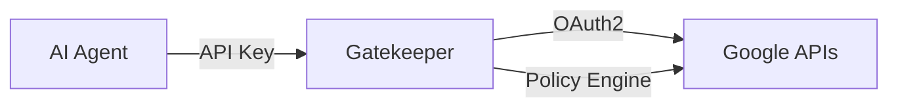

# Gatekeeper 🔐

[](https://github.com/brimdor/gatekeeper/actions/workflows/ci.yml)
[](LICENSE)
[](https://www.python.org/downloads/)

**Policy gateway for Google Workspace APIs** — fine-grained control over what AI agents can do with your Google Drive, Gmail, and Calendar. Exposes enabled routes as MCP tools so agents discover and call only what you allow.

---

## Quick Start

### Option 1: One-line install (recommended)

The install script walks you through setup interactively:

```bash
curl -fsSL https://raw.githubusercontent.com/brimdor/gatekeeper/main/install.sh | bash
```

### Option 2: Install with uv

```bash
curl -LsSf https://astral.sh/uv/install.sh | sh
uv tool install "gatekeeper @ git+https://github.com/brimdor/gatekeeper"
```

### Option 3: Install with pip

```bash
pip install git+https://github.com/brimdor/gatekeeper
```

### Option 4: Podman/Docker

```bash
git clone https://github.com/brimdor/gatekeeper.git
cd gatekeeper
cp .env.example .env
# Edit .env with your Google OAuth credentials and module preferences
podman-compose up -d
```

After starting, authenticate with Google (`gatekeeper auth`), then visit `http://localhost:8080/admin` to enable modules and create an API key. See [docs/SETUP.md](docs/SETUP.md) for the full walkthrough.

---

## Why Gatekeeper?

Google's OAuth scopes are all-or-nothing. `gmail.modify` gives full read/write/delete on everything. There's no way to say "read-only this label" or "create events but never delete them."

Gatekeeper sits between your AI agents and Google's APIs, acting as a policy layer:

- **Enable/disable individual routes** — turn off `gmail.messages.send` but keep `gmail.messages.list`
- **Cap limits** — restrict `maxResults` to 50, limit recipients to 5
- **Filter data** — exclude SPAM/TRASH from Gmail, block sensitive fields
- **Audit everything** — every request logged with key, route, status, timestamp
- **MCP server** — agents discover only enabled routes as tools, auto-updating when you toggle routes in the admin UI



For the full design walkthrough, see [docs/ARCHITECTURE.md](docs/ARCHITECTURE.md).

---

## Setup

1. **Configure environment:** `cp .env.example .env` and set at minimum `GATEKEEPER_GOOGLE_CLIENT_ID`, `GATEKEEPER_GOOGLE_CLIENT_SECRET`, and the modules you want (`GATEKEEPER_DRIVE_ENABLED`, etc.).
2. **Google OAuth setup:** Run `gatekeeper auth` (desktop flow) or `gatekeeper auth --flow device` (headless). See the canonical OAuth steps in [docs/SETUP.md](docs/SETUP.md) § Google OAuth Setup.
3. **Start the server:** `gatekeeper serve`.
4. **(Optional) Run as a systemd service:** `gatekeeper service install` then `gatekeeper service enable`. See [docs/PODMAN_DEPLOYMENT.md](docs/PODMAN_DEPLOYMENT.md) § systemd.
5. **Configure remote MCP access:** `gatekeeper hosts add myserver.local`. See [docs/MCP_SETUP_HUMAN.md](docs/MCP_SETUP_HUMAN.md).
6. **Create an API key:**

   ```bash
   gatekeeper key create --name my-agent
   gatekeeper key create --name drive-reader --permissions drive
   ```

   Keys are prefixed with `gkp_`. The full key is shown once on creation.

For step-by-step details, see [docs/SETUP.md](docs/SETUP.md).

---

## Using with AI Agents

Gatekeeper connects to AI agents via MCP (Model Context Protocol). Write routes are disabled by default; only a human admin can enable them.

- **For humans** → [docs/MCP_SETUP_HUMAN.md](docs/MCP_SETUP_HUMAN.md)
- **For AI agents** → [docs/MCP_SETUP_AGENT.md](docs/MCP_SETUP_AGENT.md)
- **Error handling** → [docs/AGENT_ERRORS.md](docs/AGENT_ERRORS.md)

Example MCP server config:

```json
{
  "mcpServers": {
    "gatekeeper": {
      "url": "http://localhost:8080/mcp/sse",
      "transport": "sse",
      "headers": {
        "X-Gatekeeper-API-Key": "gkp_your_api_key_here"
      }
    }
  }
}
```

Every tool requires an `api_key` parameter. Disabled routes return `403`.

---

## Admin UI

Access the admin UI at `http://localhost:8080/admin/` with HTTP Basic Auth.

| Page | Purpose |
|---|---|
| **Dashboard** | Requests, keys, auth status |
| **Modules** | Enable/disable modules and routes |
| **API Keys** | Create, list, revoke keys |
| **Audit Log** | Filterable request log |
| **Auth Status** | Google OAuth connection status |

---

## REST API

Example calls:

```bash
# List Gmail messages
curl -H "Authorization: Bearer gkp_your_key" \
  http://localhost:8080/api/v1/gmail/messages/list

# Get a Drive file
curl -H "Authorization: Bearer gkp_your_key" \
  http://localhost:8080/api/v1/drive/files/get?file_id=1abc...
```

For the full reference — all 174 routes, auth, rate limits, binary/multipart routes, and admin endpoints — see [docs/API_REFERENCE.md](docs/API_REFERENCE.md). The canonical route table lives in [docs/ROUTES.md](docs/ROUTES.md).

---

## Policy Configuration

Route policies control what each key can do. Example:

```bash
curl -u admin:password -X PATCH http://localhost:8080/admin/api/routes/1 \
  -H "Content-Type: application/json" \
  -d '{"enabled": false, "policy_config": {"max_results": 25}}'
```

For the full transform list and recipes, see [docs/POLICY_REFERENCE.md](docs/POLICY_REFERENCE.md).

---

## CLI Reference

```bash
gatekeeper serve                          # Start the server
gatekeeper init                           # Initialize DB and seed policies
gatekeeper auth                           # Google OAuth (desktop flow)
gatekeeper auth --flow device             # Google OAuth (device flow)
gatekeeper key create --name my-agent     # Create an API key
gatekeeper key list                       # List keys
gatekeeper key revoke --prefix gkp_a1b2   # Revoke a key
gatekeeper status                         # Show configuration status
gatekeeper service install                # Install systemd service
gatekeeper hosts add <hostname>           # Allow MCP host
gatekeeper hosts list                     # List allowed MCP hosts
```

---

## Configuration

All configuration uses environment variables (prefix `GATEKEEPER_`) or `.env`:

| Variable | Default | Description |
|---|---|---|
| `GATEKEEPER_HOST` | `127.0.0.1` | Bind host |
| `GATEKEEPER_PORT` | `8080` | Bind port |
| `GATEKEEPER_DATABASE_URL` | `sqlite+aiosqlite:///./gatekeeper.db` | Database URL |
| `GATEKEEPER_GOOGLE_CLIENT_ID` | *(required)* | Google OAuth client ID |
| `GATEKEEPER_GOOGLE_CLIENT_SECRET` | *(required)* | Google OAuth client secret |
| `GATEKEEPER_MCP_ENABLED` | `true` | Enable MCP server |
| `GATEKEEPER_MCP_ALLOWED_HOSTS` | `[]` | Additional allowed MCP hosts |
| `GATEKEEPER_RATE_LIMIT_PER_MINUTE` | `120` | Per-key rate limit |
| `GATEKEEPER_DRIVE_ENABLED` | `false` | Enable Drive OAuth scope |
| `GATEKEEPER_GMAIL_ENABLED` | `false` | Enable Gmail OAuth scope |
| `GATEKEEPER_CALENDAR_ENABLED` | `false` | Enable Calendar OAuth scope |

Auto-generated secrets are persisted in `gatekeeper_secrets.json` (chmod 600). The file is already in `.gitignore`.

---

## Container Deployment

```bash
podman build -t gatekeeper .
podman-compose up -d
```

The `/data` volume persists the database, Google token, and secrets. For full Podman/systemd deployment instructions, see [docs/PODMAN_DEPLOYMENT.md](docs/PODMAN_DEPLOYMENT.md).

---

## Documentation

| Document | Purpose |
|---|---|
| [docs/SETUP.md](docs/SETUP.md) | Canonical install + OAuth setup |
| [docs/MCP_SETUP_AGENT.md](docs/MCP_SETUP_AGENT.md) | Agent quick start and tool usage |
| [docs/MCP_SETUP_HUMAN.md](docs/MCP_SETUP_HUMAN.md) | Human-facing MCP setup |
| [docs/PODMAN_DEPLOYMENT.md](docs/PODMAN_DEPLOYMENT.md) | Podman, Docker, and systemd deployment |
| [docs/ARCHITECTURE.md](docs/ARCHITECTURE.md) | Design walkthrough and request flow |
| [docs/API_REFERENCE.md](docs/API_REFERENCE.md) | REST API reference |
| [docs/ROUTES.md](docs/ROUTES.md) | Auto-generated route table |
| [docs/MODULE_DEVELOPMENT.md](docs/MODULE_DEVELOPMENT.md) | Add new Google API modules |
| [docs/AGENT_ERRORS.md](docs/AGENT_ERRORS.md) | Error handling and recovery |
| [docs/POLICY_REFERENCE.md](docs/POLICY_REFERENCE.md) | Policy transform reference |
| [docs/AGENT_TESTING.md](docs/AGENT_TESTING.md) | Test an agent integration |
| [docs/UPGRADING.md](docs/UPGRADING.md) | Upgrade and migration guide |
| [SECURITY.md](SECURITY.md) | Security policy |
| [CONTRIBUTING.md](CONTRIBUTING.md) | Contributing guidelines |
| [CHANGELOG.md](CHANGELOG.md) | Release notes |

---

## Security

- **TLS:** Use a reverse proxy (Caddy/nginx) for HTTPS in production.
- **API keys:** bcrypt-hashed, prefix-based lookup, revocable.
- **Token encryption:** Google OAuth tokens encrypted at rest with Fernet.
- **Network:** Binds `127.0.0.1` by default.
- **MCP host allowlist:** DNS rebinding protection; only localhost by default.
- **Admin auth:** HTTP Basic Auth with auto-generated credentials.

See [SECURITY.md](SECURITY.md) for details.

---

## Development

```bash
git clone https://github.com/brimdor/gatekeeper.git
cd gatekeeper
uv pip install -e ".[dev]"
uv run pytest tests/ -v
uv run ruff check gatekeeper/
uv run gatekeeper serve
```

---

## License

MIT
