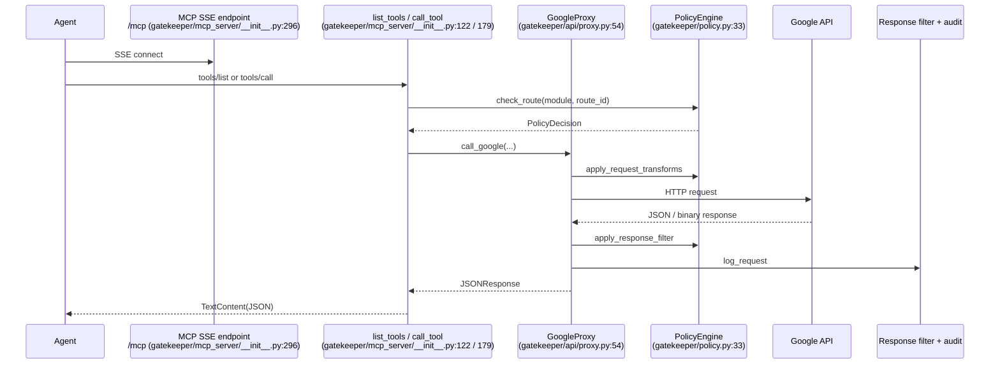
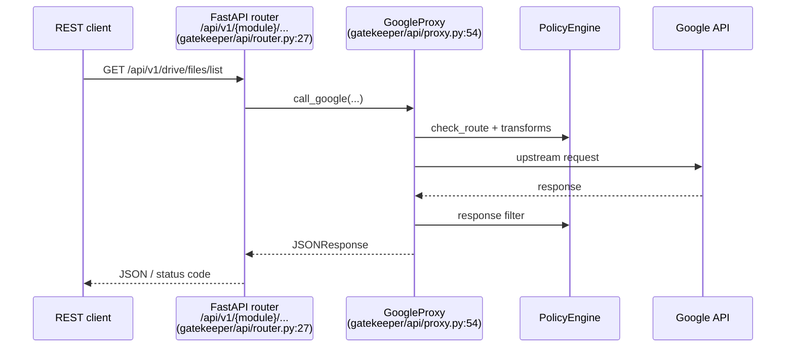
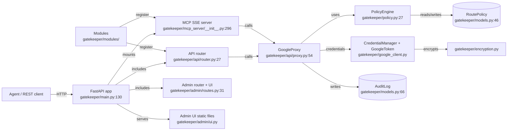
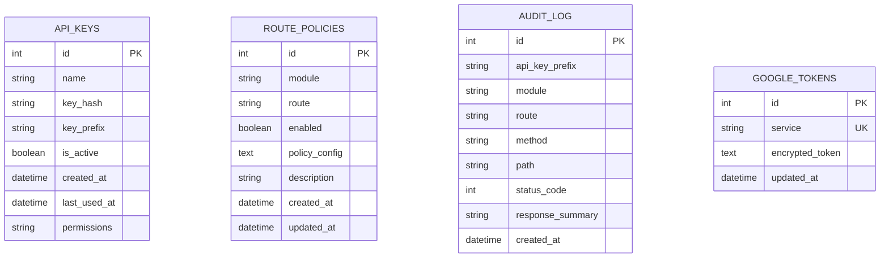

# Gatekeeper Architecture and Design Walkthrough

**Audience:** Both AI agents (sections 1–3, 8) and human operators (full document).  
**See also:** [API_REFERENCE.md](API_REFERENCE.md), [ROUTES.md](ROUTES.md), [POLICY_REFERENCE.md](POLICY_REFERENCE.md), [AGENT_ERRORS.md](AGENT_ERRORS.md).

---

## 1. What Gatekeeper Is

Gatekeeper is a policy gateway for Google Workspace APIs. It sits between an AI agent (or any REST client) and Google's APIs, enforcing per-route access controls, rate limits, request transforms, and response filters.

Gatekeeper is **not** a traditional HTTP proxy: it does not transparently forward arbitrary traffic. Instead, it exposes a curated set of Google API routes as policy-aware REST endpoints and MCP tools. It is also **not** a replacement for Google's own OAuth — you still authenticate Gatekeeper to Google using OAuth 2.0. Finally, it is **not** a multi-tenant SaaS: it is designed to run as a single-tenant service controlled by an admin who holds the Google credentials and API keys.

## 2. Request Flow — End to End

### MCP path

### REST path

## 3. Component Map

## 4. Module System

A module is a `GoogleModule` subclass that returns a list of `RouteDef` objects. The rest of Gatekeeper auto-discovers everything from that list.

Walkthrough for a single route (`drive.files.list`):

1. `gatekeeper/modules/drive/__init__.py` defines `class Module(GoogleModule)` and its `get_routes()` method.
2. `gatekeeper/modules/base.py` declares the base class fields (`name`, `display_name`, `description`, `icon`, `required_scopes`, `get_routes`, `get_default_policies`).
3. `gatekeeper/modules/route.py` defines `RouteDef` with fields: `route_id`, `method`, `google_path`, `description`, `input_schema`, `query_params`, `binary_response`, `multipart_upload`, `default_policy`, `enabled_by_default`, `base_url`.
4. `gatekeeper/api/router.py:36-63` imports each module in `AVAILABLE_MODULES`, creates an `APIRouter` per module, and converts each `route_id` to a URL path.
5. `gatekeeper/mcp_server/__init__.py:139-150` dynamically builds MCP tools from enabled routes on every `list_tools` call, so admin toggles take effect without restart.

Module registration is a one-line change in `gatekeeper/modules/__init__.py:AVAILABLE_MODULES`. See [MODULE_DEVELOPMENT.md](MODULE_DEVELOPMENT.md) for the full guide.

## 5. Policy Engine

`PolicyEngine` lives in `gatekeeper/policy.py`. For every request it:

1. Checks if the API key's `permissions` allow the module.
2. Looks up the `RoutePolicy` row for `(module, route_id)`. No row means **deny**.
3. Returns a `PolicyDecision` with `allowed`, `reason`, and `policy_config`.
4. If allowed, `apply_request_transforms` caps limits and appends filters.
5. After the Google call, `apply_response_filter` strips blocked fields and caps array lengths.

For the full transform list and recipes, see [POLICY_REFERENCE.md](POLICY_REFERENCE.md).

## 6. Authentication and Authorization Layers

Gatekeeper has three layers, applied in this order:

1. **Google OAuth (admin only).** The admin runs `gatekeeper auth` to bind Gatekeeper to a Google account. Credentials are stored encrypted in `gatekeeper.db` (`google_tokens` table) using `gatekeeper/encryption.py`. Source: `gatekeeper/google_client.py`.
2. **Gatekeeper API key.** REST requests must carry the key in the `Authorization` header (`Bearer gkp_...`) or the `X-Gatekeeper-API-Key` header. MCP requests must pass it as the `api_key` argument. Keys are hashed with bcrypt and verified by prefix in `gatekeeper/auth.py:28-60`.
3. **Per-key module permissions.** The `api_keys.permissions` column is a comma-separated list of module names or `*` for all (`gatekeeper/models.py:25`). This is checked by `PolicyEngine.check_route` before the route policy lookup.

## 7. Data Model

On-disk state:

- `gatekeeper.db` — SQLite database containing the tables above.
- `gatekeeper_secrets.json` — auto-generated Fernet key, admin password, and secret key (chmod 600). Source: `gatekeeper/config.py:93-140`.
- `google_token.json` — optional local OAuth token used by some auth flows.

## 8. Failure Modes and Recovery

- **421 DNS rebinding** — MCP SSE host rejected. Add the host via `gatekeeper hosts add` or `GATEKEEPER_MCP_ALLOWED_HOSTS`. See [AGENT_ERRORS.md](AGENT_ERRORS.md) §5.
- **429 Rate limit** — per-key sliding window exceeded. Back off and retry. See `gatekeeper/config.py:74`.
- **503 Google transient** — upstream error. Retry with exponential backoff. See [AGENT_ERRORS.md](AGENT_ERRORS.md) §4.
- **Token expiry** — the credential manager refreshes OAuth tokens automatically when a refresh token is available. If auth is completely expired, run `gatekeeper auth` again.

For the full error-code table, see [AGENT_ERRORS.md](AGENT_ERRORS.md) §2.
